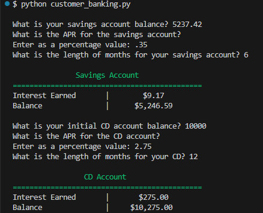

# customer_banking   

## Description
This application is a simple customer banking system that allows users to calculate and track interest earned on both their savings and CD (Certificate of Deposit) accounts.  

Users can input their account balance, APR (Annual Percentage Rate), and the number of months for their accounts. The application will then compute the interest earned and the updated balance and display it on the terminal for both types of accounts (Savings Account & CD Account).

## Table of Contents

- [Usage](#usage)
- [Credits](#credits)
- [License](#license)
- [Screenshot](#screenshot)

## Usage
>**To use the application...**  
1. Ensure you have Python installed on your system.
2. Navigate to the `banking` directory and run the script `customer_banking.py` using Python.
3. You will be prompted to enter the following details for your savings account:
   - What is your savings account balance?
   - What is the APR for the savings account?
   - What is the length of months for your savings account?
4. The application will then display the interest earned and the new updated balance for the savings account.
5. The same process will be followed for the CD account, where you will be prompted to enter the balance, APR, and length of months. The interest earned and updated balance will be displayed for the CD account as well.

## Credits
Starter code for this assignment was provided by [edX bootcamp](https://www.edx.org/boot-camps).

ANSI code reference for custom terminal colors obtained from [minism's Gist](https://gist.github.com/minism/1590432)

## License
  
 **The MIT License:** 

## Screenshot
>**Program Preview...**

  
 

